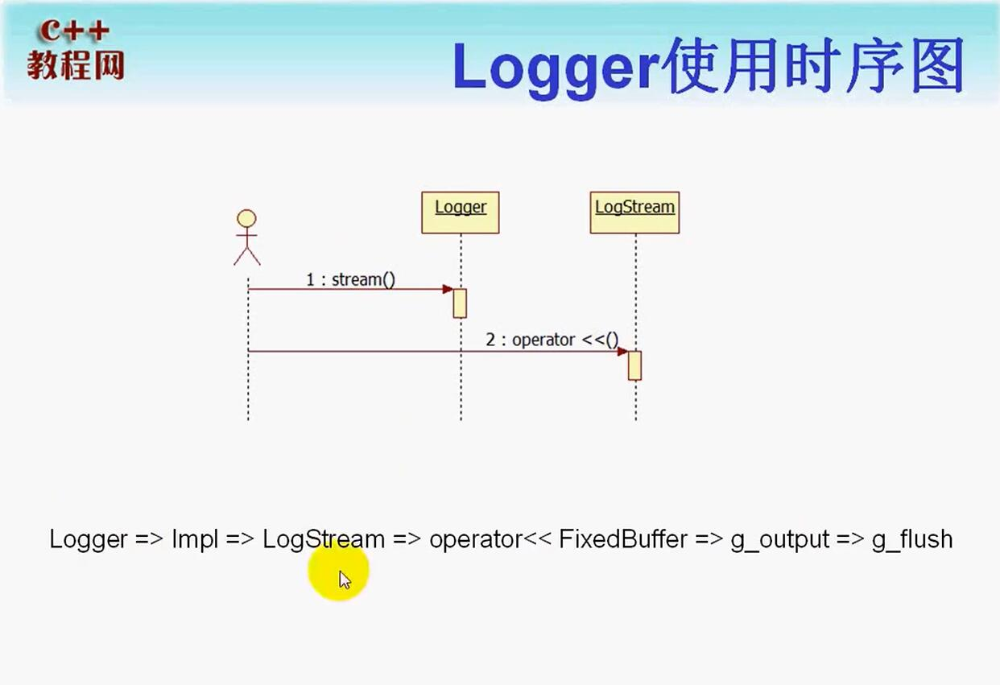

# Log设计
* __FileUtil__ 最底层的文件类AppendFile，封装了Log文件的打开、写入并在类析构的时候关闭文件，底层使用了标准IO，该append函数直接向文件写。
* __LogFile__ 封装AppendFile，加锁实现线程安全，并满足一定条件时（时间，次数，缓冲区写满等）刷新缓存区，并更换文件。
* __AsyncLogging__ 负责启动一个log线程，专门用来将log写入LogFile，应用了“双缓冲技术”，双缓冲区不够时，自动创建多个缓冲区。但当数据过多，缓冲区数量过多，只保留前两个缓冲区，删除多余缓冲区中的数据。AsyncLogging负责(定时到或被填满时)将缓冲区中的数据写入LogFile中。
* __LogStream__ 主要用来格式化输出，重载了<<运算符，同时也有自己的一块缓冲区，这里缓冲区的存在是为了缓存一行，把多个<<的结果连成一块。并且可通过设置回调函数，自定义日志输出函数（指定日志日志输出方式，文件）。
* __Logging__ 对外接口，通过宏函数创建logger临时对象，logger对象中内涵logStream对象，实现格式化打印日志信息。

## Logger使用时序图

## 异步线程启动
线程调用start()函数时，需要等待子线程创建成功后（即收到子线程发来的信号后）才能返回。对于这种一次性通信事件，采用'promise<void>',减少锁的使用。